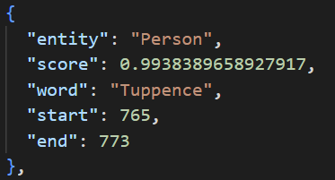
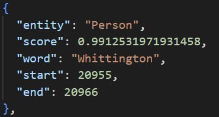
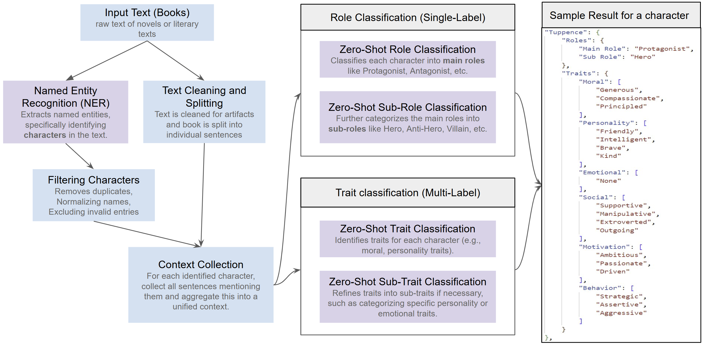
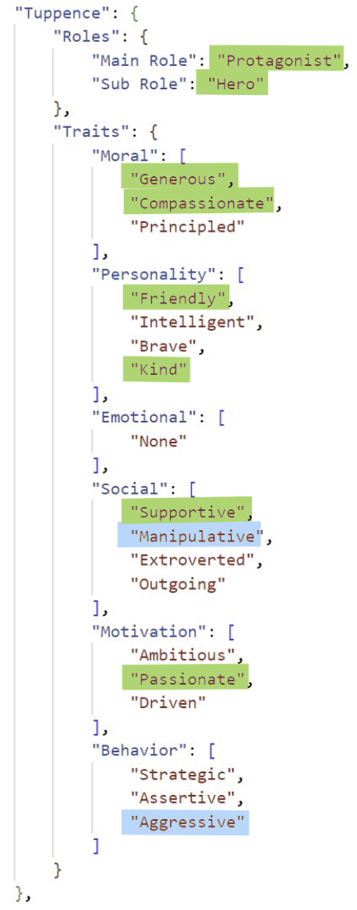
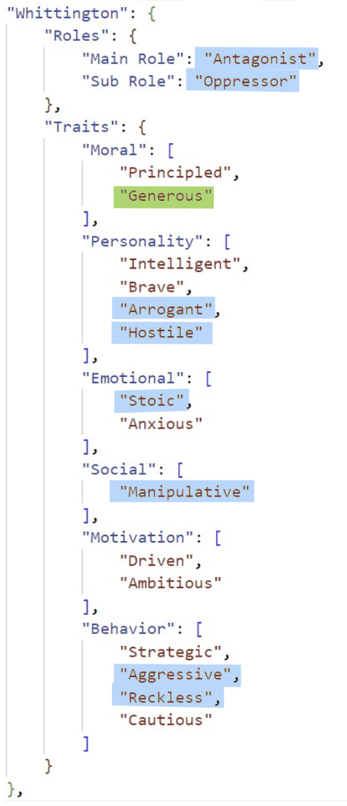
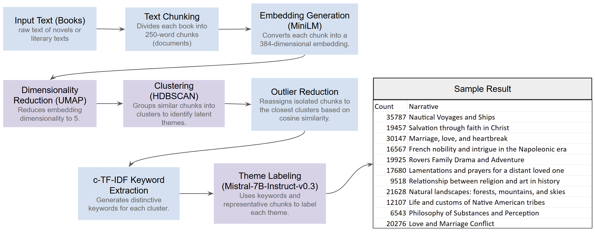
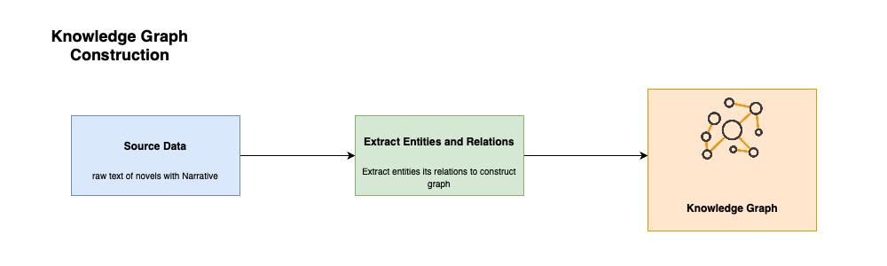
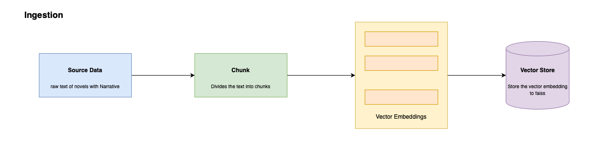
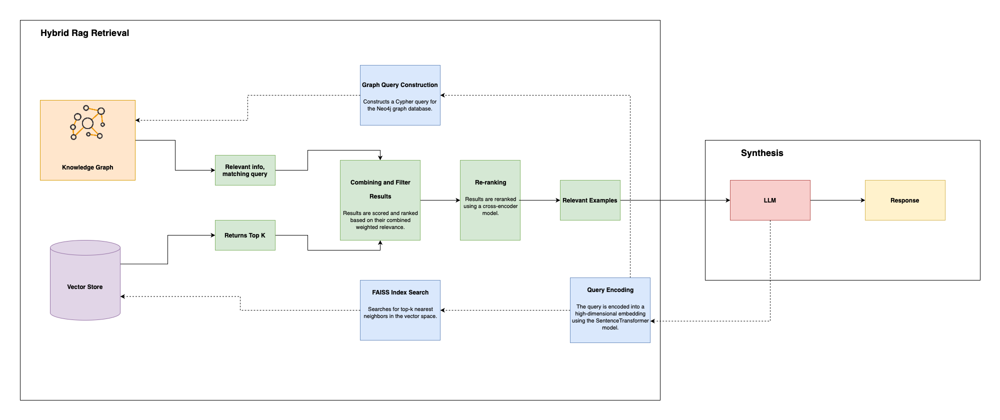
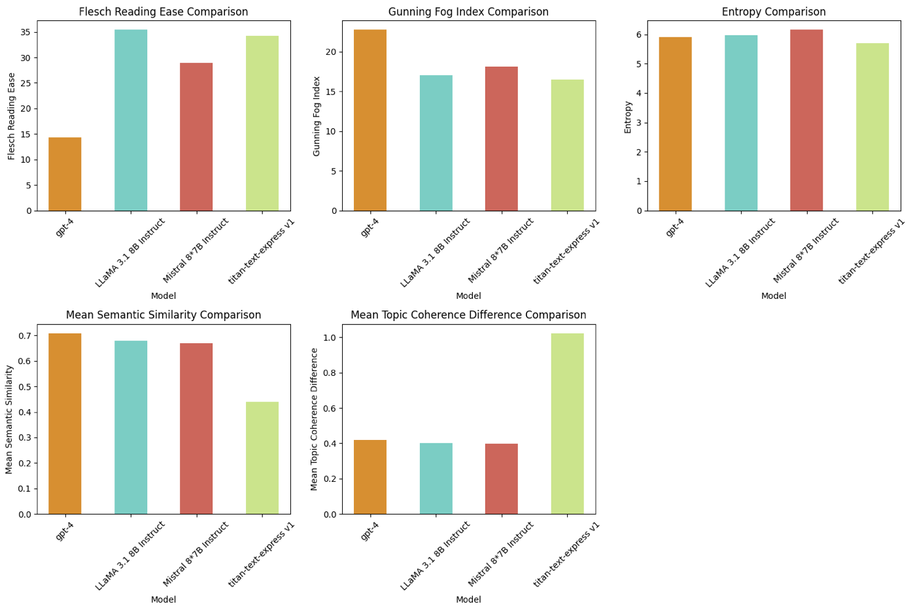

# Unveiling Narratives: Analyzing Character Roles and Themes in Novels
This repository contains the implementation of NLP modules for analyzing novels, focusing on identifying named entities, classifying their roles, and uncovering dominant narratives and themes. The project leverages advanced natural language processing techniques to provide deeper insights into plot progression, character dynamics, and thematic elements in literature.

## Datasets:
We downloaded a collection of 3,036 English books written by 142 authors from the Gutenberg Dataset for our analysis.

## Named Entity Recognition (NER)

The **NER module** is responsible for identifying key entities such as characters, locations, and objects within the text. 
- Initially, SpaCy’s pre-trained models were used, but due to a high false positive rate, a fine-tuned RoBERTa model was employed.
- The **RoBERTa model** was trained on the CoNLL-2003 dataset, ensuring high precision and recall in extracting nuanced entities in literary text.
- **Performance Metrics**: The fine-tuned RoBERTa model achieved an **F1 score of 0.91**, making it reliable for diverse novels.

**Features:**
- Identifies **persons, locations, and organizations**.
- Handles complex literary styles and varied character references.
- Outputs entities for subsequent role and narrative classification.

### Results
Below is the sample NERs detected in the book The Secret Adversary by Agatha Christie, this will be used in the Entity role clssification.

    
    

## Entity Role Classification
The Entity Role Classification module identifies and categorizes characters in novels based on their narrative roles, such as Protagonist, Antagonist, or Supporting Character. It also assigns nuanced traits across moral, emotional, and behavioral dimensions, offering a detailed understanding of character dynamics and their contributions to the story.

### Methodology

#### 1. **Preprocessing & Context Extraction**
- **Text Splitting**: Novels are tokenized into sentences, and character mentions are grouped into context-rich documents.
- **Consolidation**: Variations of character names (e.g., aliases) are resolved for consistency.

#### 2. **Hierarchical Role Classification**
- **Main Roles**: Characters are classified as **Protagonist, Antagonist,** or **Supporting Character** using a zero-shot model.
- **Sub-Roles**: Further refinement identifies nuanced roles like Hero or Schemer.

#### 3. **Trait Classification**
- **Domains**: Traits across **Moral, Personality, Emotional, Social, Behavioral,** and **Motivational** categories are identified.
- **Approach**: Multi-label zero-shot classification ensures comprehensive profiles with confidence thresholds for precision.

#### 4. **Output**
Structured character profiles include **main role, sub-role,** and **traits** to enable deeper narrative and thematic analysis.

### Results
The Entity Role Classification module was tested on The Secret Adversary by Agatha Christie, successfully identifying key characters’ roles and traits.

    
    

## Narrative Theme Identification
The Narrative Theme Identification module uncovers dominant themes within novels by clustering semantically similar text chunks. It provides a structured analysis of key narrative elements, enabling insights into plot progression, character interactions, and overarching storylines.

### Methodology

#### **Text Splitting**:
- Novels are split into **250-word chunks** for manageable, semantically coherent segments.
   
#### **Embedding Representation**:
- Text chunks are converted to **384-dimensional vectors** using `all-MiniLM-L6-v2`, clustering semantically similar chunks.

#### **Dimensionality Reduction & Clustering**:
- **UMAP** reduces dimensions for efficient clustering.
- **HDBSCAN** groups chunks into themes and handles outliers based on density.

#### **Theme Labeling**:
- **c-TF-IDF** and **KeyBERT** extract keywords.
- Labels are generated using **Mistral-7B-Instruct-v0.3** for global and book-specific themes.

#### **Evaluation**:
- Coherence scores assess cluster quality, optimized through iterative testing.

### Results

#### Corpus Overview
- **Corpus**: 3,036 books, split into **830,642 chunks**.
- **Themes Identified**: 194 latent themes.

#### Top Themes in the Corpus
| **Theme**                                   | **Chunk Count** |
|---------------------------------------------|-----------------|
| Pursuit of financial gain                   | 12,340          |
| Adventure and exploration                   | 10,456          |
| Mystery-solving partnerships                | 8,973           |
| Historical and political revolutions        | 7,812           |

#### Case Study: *The Secret Adversary*
| **Theme**                                             | **Chunk Count** |
|-------------------------------------------------------|-----------------|
| Pursuit of financial gain                             | 267             |
| Adventure of a group of friends solving mysteries     | 215             |
| Investigation and mystery-solving                     | 203             |
| Russian Imperial Family and Revolution               | 180             |

---

### Insights

1. **Dominant Themes**:
   - *Pursuit of financial gain* drives key plotlines.
   - *Mystery-solving partnerships* highlight collaboration and camaraderie.

2. **Depth**:
   - Themes like *Russian Imperial Family and Revolution* add historical context, enriching the narrative.

The method efficiently extracts themes, enabling scalable, in-depth narrative analysis.

## Narrative Explanation Generation
Narrative explanation generation extracts meaning-
ful narratives from datasets and provides contextual
explanations, critical for tasks like literary analysis
and thematic exploration. It combines semantic
understanding with structured relationships.
This work introduces a hybrid retrieval system
using semantic embeddings and knowledge graphs
to enhance narrative retrieval. The objectives are:
1. Develop a vector-based semantic search system.
2. Build a knowledge graph to encode narrative
relationships.
3. Combine both methods into a hybrid retrieval system with reranking.
This approach addresses challenges such as capturing thematic connections, structuring relational
data, and aligning semantic and structural methods.

### Knowledge Graph Construction

The knowledge graph encodes relationships between narratives, explanations, authors, and books for structured and context-rich retrieval.

    
### Vector-Based Retrieval

Vector-based retrieval and reranking were used to enhance semantic search capabilities. Narratives were encoded into high-dimensional vectors using the pre-trained all-MiniLM-L6-v2 model from SentenceTransformers, which maps texts into a semantic space. These embeddings were indexed using FAISS with an IndexFlatL2 configuration optimized for L2 distance similarity. Queries were encoded into
embeddings and matched with the top-k closest narratives from the FAISS index.

### Reranking
Reranking refined the results retrieved via FAISS. A cross-encoder model (cross-encoder/ms-marco-MiniLM-L-6-v2) evaluated query-narrative pairs, capturing fine-grained relationships and generating relevance scores. Unlike FAISS, which
relies solely on vector proximity, the cross-encoder ensures precise ranking by directly modeling
query-narrative interactions. This two-stage system combines the efficiency of FAISS with the precision of the cross-encoder, delivering contextually relevant results across diverse queries and large datasets.

### Hybrid Retrieval with Graph and Vector Store

The hybrid retrieval system combines the strengths of graph-based and vector-based methods for enhanced performance. Graphs, using Neo4j, excel at structured queries involving entity relationships,such as retrieving narratives by a specific author or explanations linked to keywords. However, they lack the ability to capture semantic similarity, which is addressed by vector-based methods like FAISS, enabling thematic and nuanced similarity searches in high-dimensional spaces.

## Result

Evaluating language models for explanation generation requires assessing readability, contextual relevance, and diversity. Key metrics include: 
- **Readability**: The **Flesch Reading Ease** measures sentence simplicity, while the **Gunning Fog Index** evaluates complexity, balancing accessibility and informativeness.
- **Linguistic Diversity**: **Entropy** captures textual variety, promoting engaging and coherent explanations.
- **Contextual Relevance**: **Semantic Similarity** ensures alignment with source contexts, avoiding hallucinations. **Topic Coherence**, using LDA, evaluates consistency with dominant topics in the input.

These metrics provide an objective framework for evaluating explanations across readability, complexity, diversity, and alignment, ensuring accessibility and coherence across domains.

The evaluation highlights strengths and weaknesses
across metrics:
- **GPT-4**: Achieves highest Semantic Similarity (0.70) and lowest Topic Coherence Difference (0.41) but produces complex outputs (Flesch:14.33, Fog: 22.75).
- **LLaMA 3.1 8B Instruct**: Balances readability (Flesch: 35.43, Fog: 17.01) with moderate Semantic Similarity (0.678).
- **Mistral 8×7B**: Offers moderate coherence (0.39) and readability (Flesch: 28.94, Fog:18.13) but lower Semantic Similarity (0.670).
- **Titan-text-express v1**: Simplest (Entropy:5.69) but lags in Semantic Similarity (0.43) and Topic Coherence Difference (1.02). 

| Model                   | Mean Semantic Similarity | Mean Topic Coherence Difference | Flesch Reading Ease | Gunning Fog Index | Entropy |
|-------------------------|--------------------------|----------------------------------|---------------------|-------------------|---------|
| GPT-4                  | **0.70**                     | 0.**41**                             | 14.33               | 22.75            | 5.91    |
| LlaMA 3.1 8B instruct  | 0.678                    | 0.40                             | **35.43**               | 17.01            | 5.97    |
| Mistral 8 7B× instruct | 0.670                    | 0.39                             | 28.94               | 18.13            | **6.15**    |
| Titan-text-express v1  | 0.43                     | 1.02                             | 34.23               | **16.51**            | 5.69    |

While readability and complexity metrics assess surface-level quality, embedding-based similarity and topic coherence depend on the robustness of underlying models, highlighting the importance of combining quantitative and qualitative evaluations.

The comprehensive evaluation framework balances readability, diversity, and contextual alignment. Despite limitations in individual metrics, it supports objective insights and fosters trust across diverse applications.

